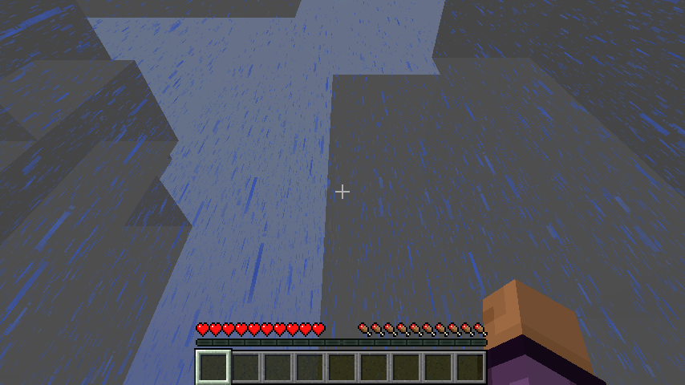
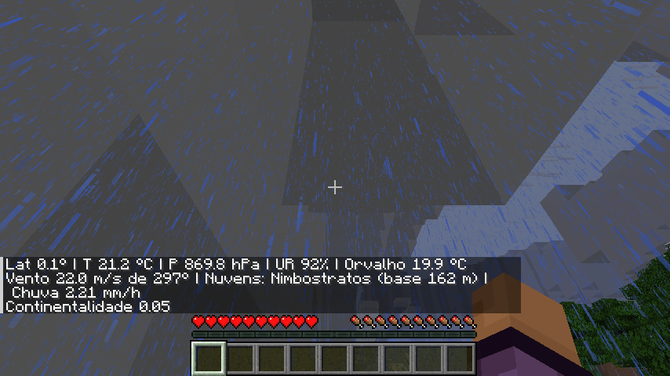
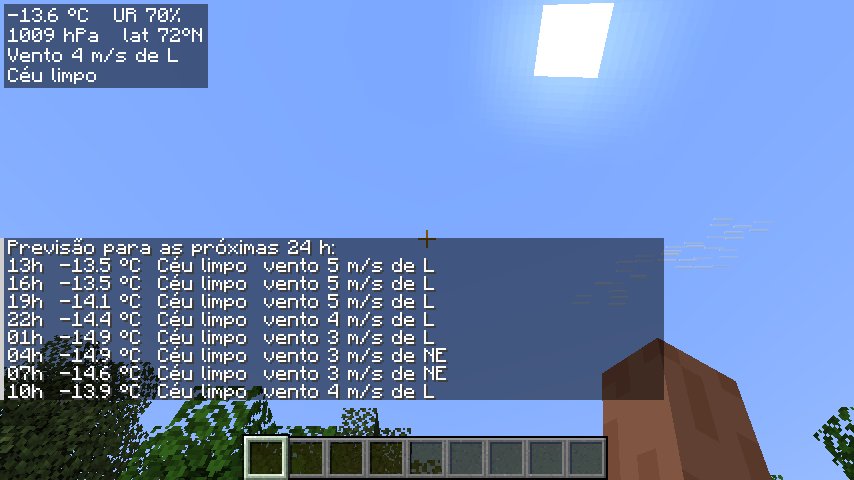
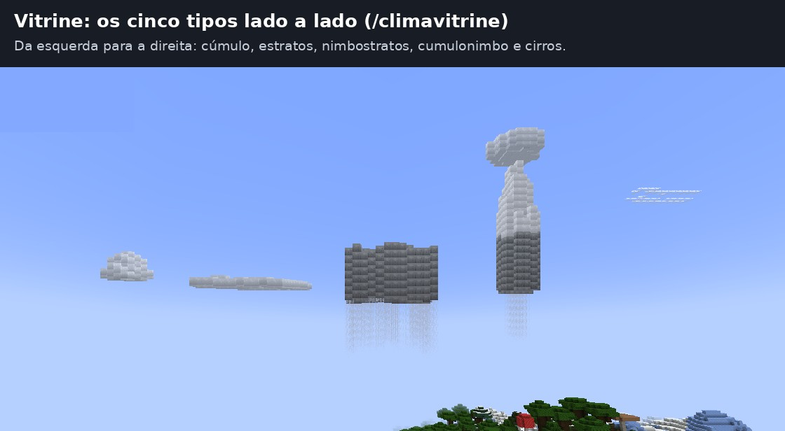
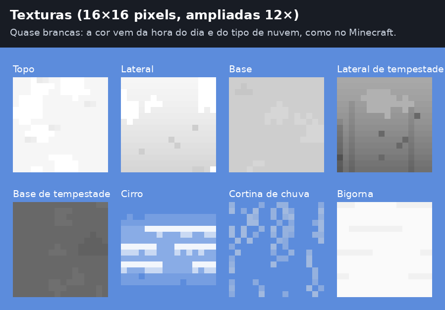

# Clima Realista (mod Fabric para Minecraft 1.21.1)

Simulação climática para o Minecraft: temperatura, pressão, vento, umidade, nuvens e
precipitação são calculados numa grade que cobre a região ao redor dos jogadores. O clima
simulado comanda a chuva, a neve e as trovoadas do jogo. Com o mod também no cliente,
cada jogador vê o tempo do lugar onde está, com nuvens 3D, neblina e um painel na tela.



## Requisitos

| Item | Versão |
|---|---|
| Minecraft | 1.21.1 |
| Fabric Loader | 0.16 ou mais novo (testado com 0.19.5) |
| Fabric API | 0.116.17+1.21.1 |
| Java | 21 |

A 1.21.1 foi escolhida por ser a versão da linha 1.21 com mais mods e ferramentas
disponíveis (Fabric e NeoForge), o que facilita usar o mod junto com outros.

## Instalar no seu Minecraft

1. Instale o [Fabric Loader](https://fabricmc.net/use/installer/) para o Minecraft 1.21.1.
2. Baixe o [Fabric API](https://modrinth.com/mod/fabric-api) para 1.21.1.
3. Copie o Fabric API e `clima-realista-<versão>.jar` (o que **não** termina em `-sources`)
   para a pasta `mods/` do Minecraft (no Windows: `%appdata%\.minecraft\mods`).
4. Abra o jogo com o perfil "fabric-loader-1.21.1".

## Compilar e testar

```bash
./gradlew build        # compila e roda os testes; o .jar fica em build/libs/
./gradlew test         # só os testes do motor climático
./gradlew demo demo2   # simulações de demonstração no terminal, sem abrir o jogo
./gradlew runClient    # abre o Minecraft com o mod (ambiente de desenvolvimento)
./gradlew runServer    # servidor dedicado com o mod (aceite a EULA em run/eula.txt)
```

## Como usar

| Comando ou tecla | O que faz |
|---|---|
| `/clima` | Tempo agora onde você está: temperatura, pressão, umidade, vento, nuvens, chuva |
| `/clima previsao` | Previsão para as próximas 24 h, de 3 em 3 horas |
| Tecla **K** | Mostra/oculta o painel do tempo no canto da tela (muda em Opções → Controles) |
| `/climavitrine` | Mostra ao norte um exemplar de cada tipo de nuvem (só no seu cliente); de novo para desligar |



A previsão roda o próprio modelo adiante, como os centros de meteorologia fazem. Para
imitar a incerteza real, a temperatura inicial recebe uma pequena perturbação; por isso
a previsão para daqui a 3 h costuma acertar, e a de 24 h, nem sempre.



No servidor, a chuva vanilla (que afeta plantações, mobs e raios) segue a **maioria** dos
jogadores, porque no Minecraft a chuva é uma só para o mundo todo. Para controlar o tempo
manualmente com `/weather`, desligue o ciclo: `/gamerule doWeatherCycle false`. Com a
regra desligada, o mod não mexe no clima vanilla.

A neve se acumula e a água congela onde a temperatura **simulada** está abaixo de 0,5 °C,
e só onde o modelo diz que está nevando. Quando esquenta (acima de 2 °C), a neve e o gelo
dos lagos derretem aos poucos. No vanilla isso não acontece: a neve depende só do bioma
e nunca derrete sozinha.

Clientes **sem** o mod podem entrar num servidor que o tem; eles veem só o clima global.

## Nuvens: formas e texturas

As nuvens são desenhadas no estilo das nuvens do Minecraft, mas com uma forma para cada
tipo. Cada célula de 16 blocos vira 4×4 colunas de 4 blocos: cúmulos em domo de base reta,
estratos em camada fina com bordas irregulares, nimbostratos grossos e escuros com cortinas
de chuva, cumulonimbos com torre e bigorna, e cirros em faixas finas e altas.



As texturas são pixel art de 16×16 num único atlas,
`src/client/resources/assets/climamod/textures/environment/clouds_atlas.png`, gerado pelo
script `tools/gerar_texturas_nuvens.py` (rode `python3 tools/gerar_texturas_nuvens.py`
depois de mudar o script; precisa do Pillow). Também dá para editar o PNG direto num editor
de imagens. Elas são quase brancas porque a cor vem da hora do dia e do tipo de nuvem.



## Configuração

Na primeira vez que o mundo abre, o mod cria `config/climamod.json`. Ele é lido toda vez
que o mundo (ou o servidor) inicia. Valores fora da faixa segura são corrigidos e
anotados no log. Principais opções:

| Opção | Padrão | Efeito |
|---|---|---|
| `mod.gridCells` | 96 | Células por lado da área simulada (96 × 16 blocos ≈ 1.500 blocos) |
| `mod.stepTicks` | 200 | Ticks entre passos da simulação (200 = 10 s) |
| `mod.syncVanillaWeather` | true | Chuva/trovoada do jogo seguem o modelo |
| `mod.snowFromModel` | true | Neve e gelo pela temperatura simulada |
| `mod.meltSnow` / `meltAboveC` | true / 2,0 | Derretimento de neve e gelo |
| `physics.halfRangeBlocks` | 20000 | Blocos do equador ao polo (o "tamanho do planeta") |
| `physics.daysPerYear` | 24 | Dias de jogo por ano (duração das estações) |
| `physics.frictionLand` / `frictionSea` | 8e-5 / 4e-5 | Atrito do vento com o solo e com o mar |
| `physics.maxBreeze` | 10 | Velocidade máxima das brisas (m/s) |

Mudar `gridCells` ou `cellBlocks` descarta o estado salvo e recomeça do equilíbrio.

## Como o modelo funciona (resumo)

O mundo é um planeta em escala: Z = 0 é o equador e Z = −20.000 o polo norte. Um bloco
vale 500 m na horizontal e 15 m na vertical, e o ano tem 24 dias de jogo. Cada célula
de 8 km guarda temperatura, pressão, vapor, água de nuvem e vento, e a cada passo:

- a temperatura relaxa para o equilíbrio da latitude, da estação, da hora e da altitude,
  mais devagar sobre o mar (inércia térmica);
- o vento transporta calor, vapor e nuvens (advecção semi-lagrangiana);
- o vento é a soma da **circulação geral** (gradiente de pressão + Coriolis + atrito, o
  que gera alísios, ventos de oeste e calmarias) com as **brisas térmicas** (corrente de
  gravidade com velocidade 0,6·√(g·h·ΔT/T): brisa marítima de dia, terral à noite);
- o ar sobe por encostas, convergência ou convecção, esfria e condensa (fórmula de
  Magnus); a nuvem densa vira chuva;
- o tipo de nuvem é deduzido do estado (cúmulos, estratos, nimbostratos, cumulonimbos,
  cirros, neblina).

Só água cercada de bastante água conta como "mar" para a continentalidade. Assim os
inúmeros laguinhos e rios do Minecraft não deixam o interior com clima marítimo.

## Organização do código

```
src/main/java/br/climate/core/   Motor climático em Java puro, sem dependência do Minecraft
  ClimateGrid      a simulação (temperatura, advecção, pressão, vento, umidade, nuvens, previsão)
  Physics          fórmulas e constantes: Magnus, ponto de orvalho, pressão barométrica
  ClimateConfig    parâmetros físicos ajustáveis (seção "physics" do climamod.json)
  TerrainSource    interface que o motor usa para "ver" o relevo
src/main/java/br/climate/mod/    Integração com o servidor
  ClimateMod       ciclo de simulação, clima vanilla, neve/degelo, comandos, envio aos jogadores
  ClimateSettings  leitura e validação de config/climamod.json
  ClimateSavedData salva/carrega o estado em world/data/climamod_climate.dat
  ClimatePayload   pacote de rede com o clima local e as nuvens ao redor do jogador
  MinecraftTerrain lê relevo e bioma do gerador de mundo, em segundo plano e com cache
  mixin/           neve e gelo pela temperatura simulada
src/client/java/br/climate/client/  Parte visual (só no cliente)
  ClimateClient, ClientClimate   recebem o pacote e suavizam chuva, trovoada e neblina
  ClimateHud                     painel do tempo na tela (tecla K)
  CloudShapes, CloudRenderer      formas em voxel de cada tipo de nuvem e o desenho com texturas
  ClimateShowcase                comando /climavitrine
  mixin/                         chuva local, neve pela temperatura, neblina, oculta as nuvens vanilla
src/test/java/br/climate/core/   Testes JUnit e as demonstrações Demo/Demo2
tools/gerar_texturas_nuvens.py   gera o atlas de texturas das nuvens
```

## Limitações conhecidas

A área simulada (cerca de 1.500 blocos de lado) acompanha o centro do grupo de jogadores.
Se estiverem espalhados demais, ela acompanha o primeiro jogador, e quem está muito longe
recebe céu limpo. Ao teleportar para longe, a área leva alguns segundos para chegar.
Se a opção de vídeo "Nuvens" estiver desligada, as nuvens simuladas também somem.
